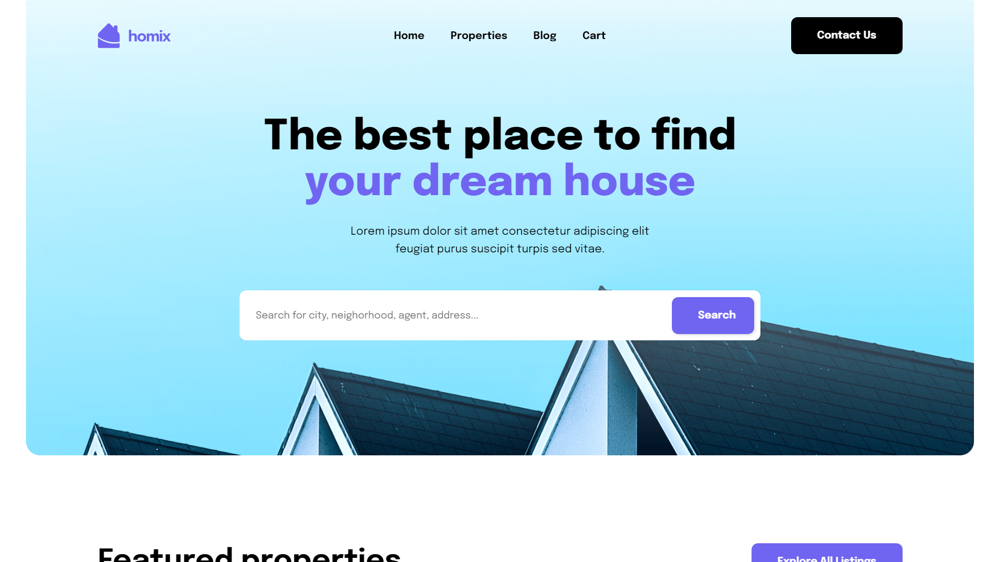

# Real Estate Website

Real Estate Website built by React that captivates your attention from the first glance, where style seamlessly matches the user interface experience. This model ensures convenient and relaxing usage while scrolling and navigating. The responsiveness of all elements in this model guarantees a pleasing user experience on different devices with various screen sizes.

The website provides all necessary tools, including a search bar to filter properties based on specific criteria, image galleries to display property images, detailed property descriptions, contact banner, and more to enhance the competitiveness of your sale-and-rent business on the net.

### Highlights

* Unique Design
* Interactions
* Fully Responsive
* Compatibility with Browsers

### Sections

* Homepage
    * Hero
    * Featured
    * Banner
    * Categories
    * Quote
    * FAQ
    * Contact
* Properties
* Blog
* Footer

# Instalation

> [!IMPORTANT]
> Make sure you've already installed [Node](https://nodejs.org/en) and [Git](https://git-scm.com/) on your machine earlier.

Head into your folder and clone the repo by typing these comands in your terminal to check out the project:

```bash
git clone https://github.com/artyom250/real-estate.git
cd real-estate
npm install
npm run dev
```